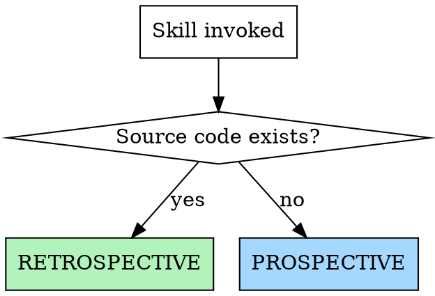

# Software Architect

Arquitecto de software personal. Planifica proyectos nuevos y documenta proyectos existentes.

## Mode Detection

**Retrospective** (existing code): Analyze first, ask second. See [reference/retrospective-flow.md](reference/retrospective-flow.md)
**Prospective** (new project): Guide conversation, then generate. See [reference/prospective-flow.md](reference/prospective-flow.md)

## Adaptive Clarity

- **Vague description** -> Ask questions one at a time (prefer multiple choice)
- **Detailed spec** -> Generate draft directly, user validates
- **Specific sections requested** -> Generate only those

## Available Sections (user selects)

| # | Section | Dependencies |
|---|---------|-------------|
| 01 | System Architecture (C4) | independent |
| 02 | Use Cases | independent |
| 03 | Domain Model | independent |
| 04 | ER Diagram | independent |
| 05 | API Catalog | references 02 |
| 06 | State Diagrams | independent |
| 07 | Requirements (FR/NFR) | references 02 |
| 08 | Traceability Matrix | requires 02 + 07 |
| 09 | Sequence Diagrams | requires 02 |
| 10 | Activity Diagrams | requires 02 |
| 11 | Error Map | references 02 |
| 12 | Risk Matrix | independent |
| 13 | Technical Decisions (ADR) | independent |

Full templates: [reference/sections-catalog.md](reference/sections-catalog.md)

## Global Rules

- ALL diagrams in Mermaid
- Mark `[INFERRED]` for assumptions, `[PENDING]` for unknowns
- Each file self-contained with cross-references
- Output directory configurable (default: `docs/engineering/`)
- Generate INDEX.md linking all documents at the end

## Workflow

1. Detect mode (prospective/retrospective)
2. Ask user which sections to generate (default: all)
3. Ask user for output directory (default: `docs/engineering/`)
4. Generate sections respecting dependency order
5. Generate INDEX.md
6. Offer implementation bridge. See [reference/implementation-bridge.md](reference/implementation-bridge.md)
