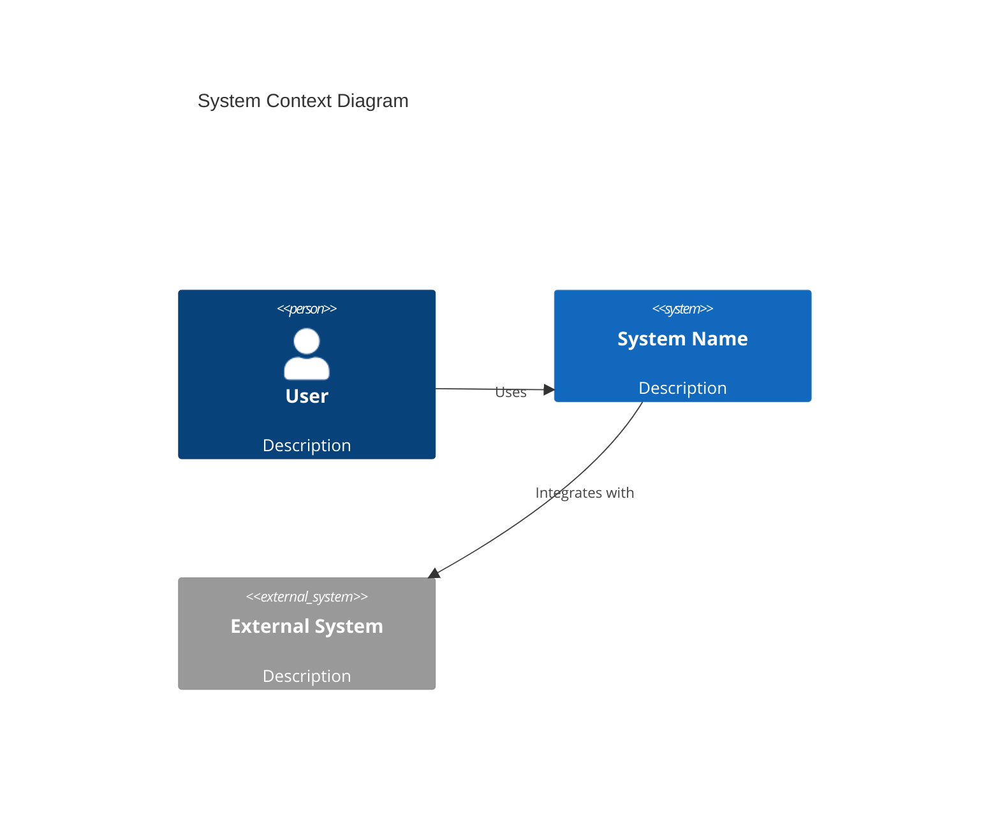
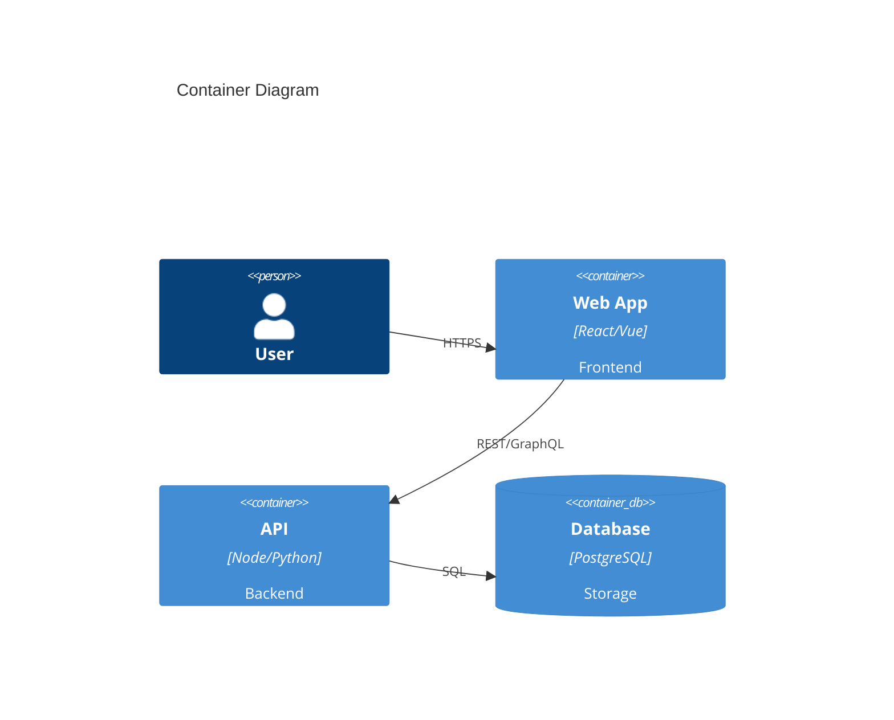
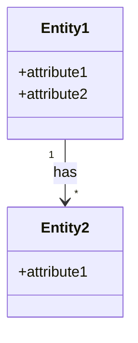
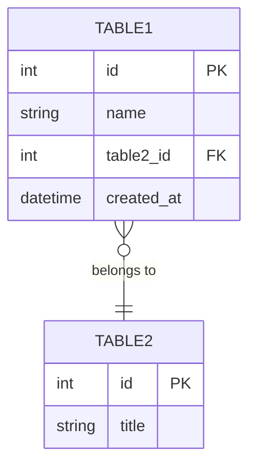
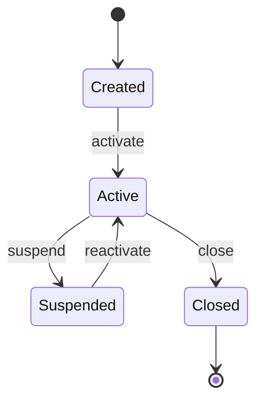
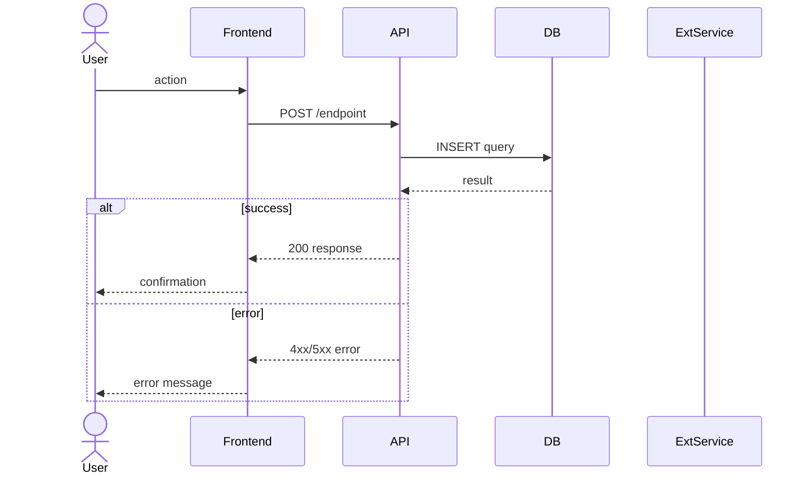
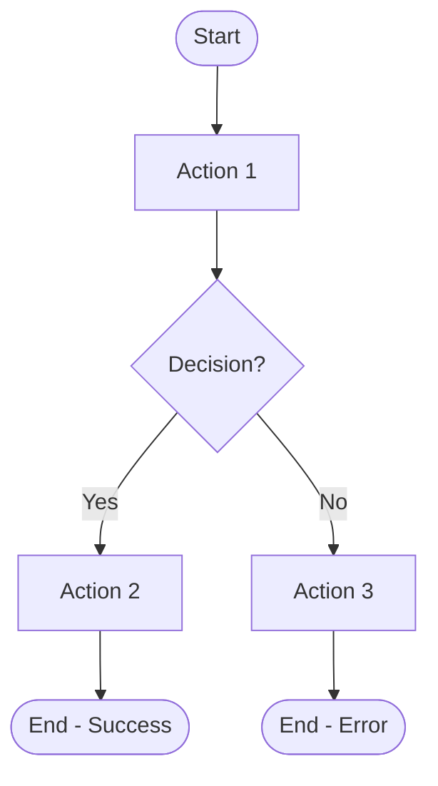

# Engineering Documentation — Sections Catalog

Templates for all 13 documentation sections. Each section produces one markdown file.

---

## 01: System Architecture (C4)

**File:** `01-arquitectura-sistema.md`
**Objective:** Show system context and internal containers using C4 model.
**Primary sources:** docker-compose, Dockerfiles, config files, README, infrastructure code.

**Template:**

### Level 1 — System Context



### Level 2 — Containers



Include: protocols, ports, technologies, infrastructure services.

**Quality criteria:** All external systems identified, all internal containers shown, communication protocols labeled.

---

## 02: Use Cases

**File:** `02-casos-de-uso.md`
**Objective:** Document all system use cases with detailed flows.
**Primary sources:** routes/controllers, user-facing features, business logic.

**Template per use case:**

| Field | Content |
|-------|---------|
| ID | CU-001 |
| Name | [Use case name] |
| Description | [What this use case achieves] |
| Primary actors | [Users/systems that initiate] |
| Offstage actors | [Indirect stakeholders, external systems] |
| Preconditions | [What must be true before] |
| Postconditions | [What is true after success] |

**Happy path** (3-5 high-level steps):
1. Actor does X
2. System responds with Y
3. ...

**Detailed flow** (numbered, with validations):
1. Actor submits form with fields A, B, C
2. System validates: A is required, B must be > 0
3. System creates record in database
4. System returns confirmation with ID
5. ...

**Alternative flows:**
- 2a. If B is zero, system shows warning and allows override
- ...

**Exception flows:**
- 2b. If validation fails, system returns error 422 with field details
- 3a. If database unavailable, system returns 503 and queues request
- ...

**Quality criteria:** All CRUD operations covered, all user roles have at least one use case, error flows documented.

---

## 03: Domain Model

**File:** `03-modelo-dominio.md`
**Objective:** Conceptual class diagram showing business entities and relationships.
**Primary sources:** ORM models, database schemas, business logic.

**Template:**



For each entity include: brief description, business responsibility, key attributes (conceptual, not technical types).

**Quality criteria:** All business entities present, relationships with cardinalities, no technical implementation details.

---

## 04: ER Diagram (Physical)

**File:** `04-diagrama-er.md`
**Objective:** Physical database model with types, PKs, FKs, indexes.
**Primary sources:** migrations, ORM models, database schema dumps.

**Template:**



Include: all columns with types, PK/FK markers, constraints (UNIQUE, NOT NULL, CHECK, DEFAULT), indexes.

**Quality criteria:** Matches actual database schema, all relationships shown, constraints documented.

---

## 05: API Catalog

**File:** `05-catalogo-api.md`
**Objective:** Document every endpoint with full contract.
**Primary sources:** route files, controllers, Swagger/OpenAPI specs.
**Dependencies:** References CU-XXX from section 02.

**Template per endpoint:**

| Field | Content |
|-------|---------|
| Method | GET/POST/PUT/PATCH/DELETE |
| Path | `/api/v1/resource/:id` |
| Description | Brief description |
| URL Params | `id` (integer, required) |
| Query Params | `page` (integer, optional, default: 1) |
| Auth | Required (Bearer token) / None |
| Related Use Case | CU-001 |

**Request body:**
```json
{
    "field": "value",
    "nested": { "key": "value" }
}
```

**Responses:**

| Code | Description | Body |
|------|-------------|------|
| 200 | Success | `{ "id": 1, "field": "value" }` |
| 400 | Validation error | `{ "error": "message" }` |
| 401 | Unauthorized | `{ "error": "Invalid token" }` |
| 404 | Not found | `{ "error": "Resource not found" }` |

**Quality criteria:** All endpoints documented, example bodies provided, all response codes listed.

---

## 06: State Diagrams

**File:** `06-diagramas-estado.md`
**Objective:** Document lifecycle of entities with state changes.
**Primary sources:** status/state fields in models, state machines, enums.

**Template per entity:**



| State | Description |
|-------|-------------|
| Created | Initial state after record creation |
| Active | Normal operating state |
| Suspended | Temporarily disabled |
| Closed | Terminal state, no further transitions |

**Quality criteria:** All states reachable, terminal states identified, transitions labeled with triggering event.

---

## 07: Requirements

**File:** `07-requerimientos.md`
**Objective:** List all functional and non-functional requirements.
**Primary sources:** features in code, configuration, infrastructure.
**Dependencies:** References CU-XXX from section 02.

**Functional Requirements:**

| ID | Description | Priority | Status | Related CU |
|----|-------------|----------|--------|------------|
| RF-001 | [description] | High/Medium/Low | Implemented/Partial/Pending | CU-001 |

**Non-Functional Requirements:**

| ID | Category | Description | Metric | Status |
|----|----------|-------------|--------|--------|
| RNF-001 | Performance | [description] | [acceptance criteria] | Implemented/Partial/Pending |

Categories: performance, security, usability, availability, scalability, maintainability.

**Quality criteria:** All features have corresponding RF, security and performance RNFs present.

---

## 08: Traceability Matrix

**File:** `08-matriz-trazabilidad.md`
**Objective:** Cross-reference requirements with use cases.
**Dependencies:** REQUIRES sections 02 and 07.

**Template:**

| Requirement | CU-001 | CU-002 | CU-003 | Coverage |
|-------------|--------|--------|--------|----------|
| RF-001 | x | | x | Covered |
| RF-002 | | x | | Covered |
| RF-003 | | | | NOT COVERED |
| RNF-001 | x | x | x | Covered |

Summary row: requirements covered per use case.

**Quality criteria:** Every requirement appears, uncovered requirements flagged.

---

## 09: Sequence Diagrams

**File:** `09-diagramas-secuencia.md`
**Objective:** Show interaction between components for each main use case.
**Dependencies:** REQUIRES section 02 (one diagram per main CU).

**Template:**



Include: all participants, sync/async messages, alt/opt blocks for error flows, activation bars.

**Quality criteria:** Matches use case flows, error paths shown, external services included.

---

## 10: Activity Diagrams

**File:** `10-diagramas-actividad.md`
**Objective:** Show process flow with decisions and parallel paths.
**Dependencies:** REQUIRES section 02.

**Template:**



Include: start/end nodes, decision points, parallel paths (fork/join if applicable), swimlanes for multi-actor flows.

**Quality criteria:** All paths lead to end state, decisions have all branches, matches use case flows.

---

## 11: Error Map

**File:** `11-mapa-errores.md`
**Objective:** Document all error handling in the system.
**Primary sources:** error handlers, middleware, try/catch blocks, error constants.
**Dependencies:** References CU-XXX from section 02.

**Template:**

| Code/Type | Origin | User Message | Technical Log | Recovery | CU | Severity |
|-----------|--------|-------------|---------------|----------|-----|----------|
| 400 | API | "Invalid input" | Validation failed: field X | Show form errors | CU-001 | Low |
| 500 | API | "Server error, try later" | Unhandled exception in service Y | Retry + alert | CU-002 | Critical |
| TIMEOUT | ExtService | "Service unavailable" | Timeout after 30s calling API Z | Retry 3x then fail | CU-003 | High |

**Quality criteria:** All HTTP error codes covered, external service failures documented, recovery strategies defined.

---

## 12: Risk Matrix

**File:** `12-matriz-riesgos.md`
**Objective:** Identify and assess technical risks.
**Primary sources:** dependencies, infrastructure, architecture decisions.

**Template:**

| ID | Risk | Probability | Impact | Level | Mitigation | Component | Status |
|----|------|-------------|--------|-------|------------|-----------|--------|
| RT-001 | External API downtime | Medium | High | High | Circuit breaker + cache fallback | API integration | Mitigated |
| RT-002 | Database data loss | Low | Critical | High | Daily backups + replication | Database | Pending |

Consider: API failures, data loss, performance bottlenecks, security vulnerabilities, outdated dependencies, missing backups, single points of failure.

**Quality criteria:** At least 5 risks identified, mitigation strategies present, severity levels justified.

---

## 13: Technical Decisions (ADR)

**File:** `13-decisiones-tecnicas.md`
**Objective:** Record architectural decisions with context and rationale.
**Primary sources:** tech stack, dependencies, project structure, patterns used.

**Template per decision:**

### ADR-001: [Decision Title]

- **Date:** [known or unknown]
- **Status:** Accepted / Proposed / Deprecated / Superseded
- **Context:** What problem or need motivated this decision?
- **Decision:** What was decided?
- **Alternatives considered:** What other options existed? Why rejected?
- **Consequences:** Advantages and disadvantages of the decision taken.

**Quality criteria:** All major tech stack choices documented, alternatives listed, trade-offs explicit.
